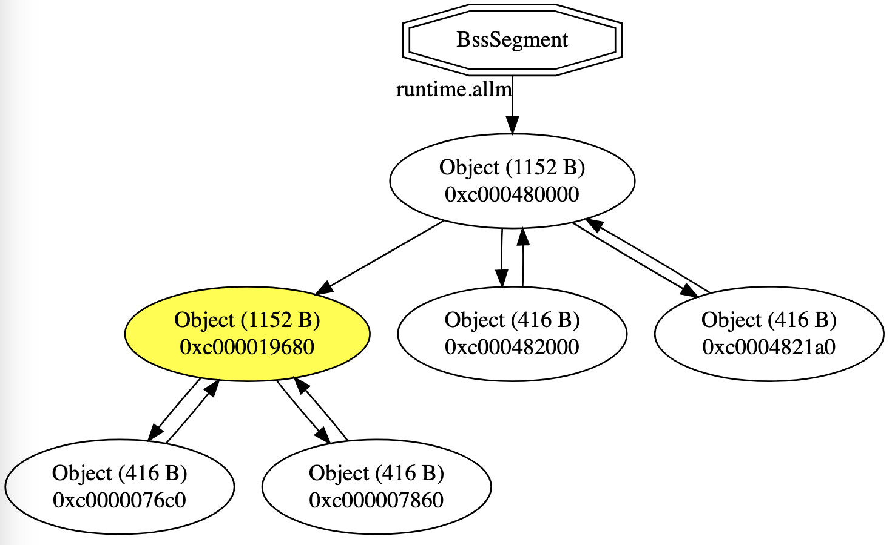
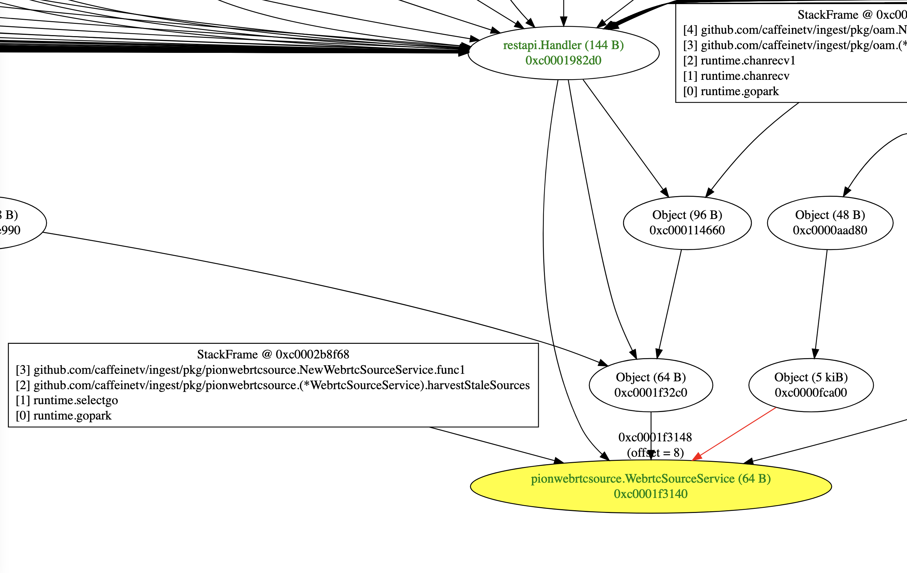

# Introduction

Tracking down memory leaks in Go applications can be a relatively tricky prospect. The first pass at tracking down issues involves the use of [pprof](https://github.com/google/pprof), which can be very helpful in determining which object types are consuming memory, and which stack frame initially allocated those objects. There are [literally hundreds of blog posts](https://www.google.com/search?q=pprof+memory+leaks) that cover how to use it to kind of triangulate where in your program a memory leak may be occurring.

For more complex memory leak situations, these approaches require a fair degree of inference about why any given object isn't being released by the garbage collector, as well as a compete knowledge of how your entire application -- including any imported packages -- may be keeping track of objects. 

Luckily, the go runtime provides a [`debug.WriteHeapDump()`](https://pkg.go.dev/runtime/debug#WriteHeapDump) function that produces a heap dump file in a format that is [reasonably well-documented](https://zchee.github.io/golang-wiki/heapdump15-through-heapdump17/). Unfortunately, there seem to be (as of February 2023) no tools that can perform any meaningful processing on those files. That's where heapspurs comes in.

Heapspurs parses the Go heap format and provides a small toolkit that can help identify exactly why an object is still hanging around.

Before diving into tool usage, it probably helps to have some understanding of the way Go handles memory. The article [Go Memory Management](https://dougrichardson.us/notes/go-memory-allocations.html) provides an accessible and mercifully short introduction to that topic.

# Using the Tool

To build the heapspurs utility itself, `go build ./cmd/heapspurs` should just work. Once you've done that, you'll need a heap file to operate on. In the program that you're troubleshooting, add code similar to the following, and trigger it when the system is in a state of unexpected memory use (I typically set up a handler for SIGUSR1 to cause a heap dump, but any approach should work):

```go
f, err := os.Create(filename)
if err != nil {
  panic("Could not open file for writing:" + err.Error())
} else {
  runtime.GC()
  debug.WriteHeapDump(f.Fd())
  f.Close()
}
```

It's recommended to force a garbage collection cycle immediately prior to writing the heap, so that your analysis deals with only those objects that are actually reachable.

Once you have done that, you can start investigating what's going on in with your application's memory use.

## Viewing the Raw Heapdump Records

If you want to simply see what records exist in the heapdump itself, you can invoke the tool with the `--print` flag:

`./heapspurs heapdump --print`

This produces huge volumes of data, even for a relatively small program, in the order in which it is written into the file. The output will generally contain objects that look like the following:

```
DumpParams: BigEndian=false, PointerSize=8, Heap=0xc000000000-0xc004000000, Architecture=amd64, GOEXPERIMENT=go1.19.5, Cpus=12
TypeDescriptor for 'fmt.' @ 0x1003db320: Objects are 8 bytes
Itab @ 0x100456590: 0x1003db320
...
Object @ 0xc000016000 with 4 pointers in 64 bytes
  Pointer[0]@0xc000016000 = 0x7ff7bfeff450
  Pointer[1]@0xc000016010 = 0x7ff7bfeff45c
  Pointer[2]@0xc000016020 = 0x7ff7bfeff467
  Pointer[3]@0xc000016030 = 0x7ff7bfeff470
...
Goroutine[1] @ 0xc0000061a0: Waiting (wait for GC cycle), Stack @ 0xc0000d2700
StackFrame[0] @ 0xc0000d2700: runtime.systemstack_switch with 0 pointers in 8 bytes; child = 0x0
StackFrame[1] @ 0xc0000d2708: runtime/debug.WriteHeapDump with 0 pointers in 5832 bytes; child = 0xc0000d2700
StackFrame[2] @ 0xc0000d3dd0: main.main with 1 pointers in 432 bytes; child = 0xc0000d2708
  Pointer[0]@0xc0000d3e70 = 0xc0000a6100
StackFrame[3] @ 0xc0000d3f80: runtime.main with 1 pointers in 96 bytes; child = 0xc0000d3dd0
  Pointer[0]@0xc0000d3fc8 = 0xc0000d3fb8
...
DataSegment @ 0x100609660-0x100615fd0 with 2947 pointers
  Pointer[0]@0x100609668 = 0x10036c590
  Pointer[1]@0x100609670 = 0x10036c1f0
  Pointer[2]@0x100609678 = 0x10036c4c0
  Pointer[3]@0x100609680 = 0x10036c5f0
  Pointer[4]@0x100609688 = 0x1005b4e40
...
BssSegment @ 0x100642fe0-0x100677460 with 10815 pointers
  Pointer[0]@0x100642fe0 = 0xc0000f0000
  Pointer[1]@0x100642fe8 = 0xc0000f00b0
  Pointer[2]@0x100642ff0 = 0xc0000f0160
  Pointer[3]@0x100642ff8 = 0xc0000aa008
  Pointer[4]@0x100643000 = 0xc00008e060
...
RegisteredFinalizer @ 0xc0000a8420: FuncVal: 0x100412dd0, Type: 0x10039d6e0, Object Type: 0x10039d6e0
MemStats: {Alloc:257584 TotalAlloc:331968 Sys:13548560 Lookups:0 Mallocs:1632 Frees:688 HeapAlloc:257584 HeapSys:3768320 HeapIdle:2973696 HeapInuse:794624 HeapReleased:2752512 HeapObjects:944 StackInuse:393216 StackSys:393216 MSpanInuse:49248 MSpanSys:65088 MCacheInuse:14400 MCacheSys:15600 BuckHashSys:4154 GCSys:8102480 OtherSys:1199702 NextGC:4194304 LastGC:1677192712944952000 PauseTotalNs:18336 PauseNs:[18336 0 0 0 0 0 0 0 0 0 0 0 0 0 0 0 0 0 0 0 0 0 0 0 0 0 0 0 0 0 0 0 0 0 0 0 0 0 0 0 0 0 0 0 0 0 0 0 0 0 0 0 0 0 0 0 0 0 0 0 0 0 0 0 0 0 0 0 0 0 0 0 0 0 0 0 0 0 0 0 0 0 0 0 0 0 0 0 0 0 0 0 0 0 0 0 0 0 0 0 0 0 0 0 0 0 0 0 0 0 0 0 0 0 0 0 0 0 0 0 0 0 0 0 0 0 0 0 0 0 0 0 0 0 0 0 0 0 0 0 0 0 0 0 0 0 0 0 0 0 0 0 0 0 0 0 0 0 0 0 0 0 0 0 0 0 0 0 0 0 0 0 0 0 0 0 0 0 0 0 0 0 0 0 0 0 0 0 0 0 0 0 0 0 0 0 0 0 0 0 0 0 0 0 0 0 0 0 0 0 0 0 0 0 0 0 0 0 0 0 0 0 0 0 0 0 0 0 0 0 0 0 0 0 0 0 0 0 0 0 0 0 0 0 0 0 0 0 0 0 0 0 0 0 0 0] NumGC:1}
End Of File
```

## Finding Leaks

In most cases, you're looking for unexpected objects and trying to figure out what anchors are preventing the garbage collector from deallocating them. In general, there are three things that can anchor an object and prevent it from being collected:

* A variable in an active stack frame

* A global variable in the BSS Segment

* A global variable in the Data Segment

The first thing you'll need to do is get the address of an object that you think should be deallocated but isn't. There are several ways you might discover this (e.g., from your debugger or from the `--search` flag described below), but the simplest may be simply printing it out:

```go
fmt.Printf("%T address: 0x%x\n", object, unsafe.Pointer(object))
```

Once you have the address of the object of interest, you can ask for information about which anchor(s) are keeping it alive, using the `--anchor` flag:

```
# ./heapspurs heapdump --address 0xc000019680 --anchors
BssSegment @ 0x100642fe0-0x100677460 with 10815 pointers
```

This tells us that the object at `0xc000019680` is ultimately rooted in the BSS segment, meaning that there is a series of pointers from the BSS (global variables) that ultimately lead to our object. (In many cases, the anchor list will also include one or more stack frames that transitively point to the object in question).

You can also ask about the object's direct owners by providing a `--owners 1` flag (the "1" indicates that you only want to see the things directly pointing to the object):

```
# ./heapspurs heapdump --address 0xc000019680 --owners 1
Object @ 0xc000019680 with 11 pointers in 1152 bytes
  Object @ 0xc0000076c0 with 11 pointers in 416 bytes
  Object @ 0xc000007860 with 11 pointers in 416 bytes
  Object @ 0xc000480000 with 11 pointers in 1152 bytes
```

You can ask for an arbitrary depth of owners (i.e., `--owners 2` will show owners and owners' owners); or if you just want to print all owners back to every anchor, you can specify a depth of `-1`:

```
./heapspurs heapdump --address 0xc000019680 --owners -1
Object @ 0xc000019680 with 11 pointers in 1152 bytes
  Object @ 0xc0000076c0 with 11 pointers in 416 bytes
  Object @ 0xc000007860 with 11 pointers in 416 bytes
  Object @ 0xc000480000 with 11 pointers in 1152 bytes
    Object @ 0xc000482000 with 11 pointers in 416 bytes
    Object @ 0xc0004821a0 with 11 pointers in 416 bytes
    BssSegment @ 0x100642fe0-0x100677460 with 10815 pointers
```

This, of course, all gets a bit tricky to reconstruct in your head. To help visualizing object relationships, the most intuitive way to consume information about object relationships is by producing an `svg` file, which is what the tool does by default:

```
./heapspurs heapdump --address 0xc000019680
Rendering graph (7 nodes)...
```

The default output is left in `heapdump.svg` , which you should be able to open in any web browser.


The object that you specified is highlighted in yellow, and all heap records that point to it -- even transitively -- are shown. From the graph above, we can determine that the object of interest has a pointer to it from a relatively large (1152-byte) object that is pointed to from the BSS segment (i.e., global program scope). There's a chance that this might provide enough information to get you on the right track -- especially when combined with the information you get from `pprof` -- but there's a good chance that you'll need some additional information.

Finally, you may find it useful to examine the raw contents of an object's memory, either because you know what it is and want to check the values of its underlying variables, or because you have a hunch about what it might be and would like to sanity-check your guess. The `--hexdump` flag gives you that information:

```
# ./heapspurs heapdump --address 0xc0004821a0 --hexdump
00000000  40 33 fb 0d 00 70 00 00  40 2f 03 0e 00 70 00 00  |@3...p..@/...p..|
00000010  e0 36 fb 0d 00 70 00 00  e0 36 fb 0d 00 70 00 00  |.6...p...6...p..|
00000020  00 00 00 00 00 00 00 00  00 00 00 00 00 00 00 00  |................|
00000030  00 00 48 00 c0 00 00 00  38 2f 03 0e 00 70 00 00  |..H.....8/...p..|
00000040  0c 09 04 00 01 00 00 00  a0 21 48 00 c0 00 00 00  |.........!H.....|
00000050  00 00 00 00 00 00 00 00  00 00 00 00 00 00 00 00  |................|
00000060  00 00 00 00 00 00 00 00  00 00 00 00 00 00 00 00  |................|
00000070  00 00 00 00 00 00 00 00  00 00 00 00 00 00 00 00  |................|
00000080  00 00 00 00 00 00 00 00  00 00 00 00 00 00 00 00  |................|
00000090  00 00 00 00 00 00 00 00  00 00 00 00 00 00 00 00  |................|
000000a0  00 00 00 00 00 00 00 00  00 00 00 00 00 00 00 00  |................|
000000b0  00 00 00 00 00 00 00 00  00 00 00 00 00 00 00 00  |................|
000000c0  00 00 00 00 00 00 00 00  00 00 00 00 00 00 00 00  |................|
000000d0  00 00 00 00 00 00 00 00  00 00 00 00 00 00 00 00  |................|
000000e0  00 00 00 00 00 00 00 00  00 00 00 00 00 00 00 00  |................|
000000f0  00 00 00 00 00 00 00 00  00 00 00 00 00 00 00 00  |................|
00000100  00 00 00 00 00 00 00 00  00 00 00 00 00 00 00 00  |................|
00000110  00 00 00 00 00 00 00 00  00 00 00 00 00 00 00 00  |................|
00000120  00 00 00 00 00 00 00 00  00 00 00 00 00 00 00 00  |................|
00000130  00 00 00 00 00 00 00 00  00 00 00 00 00 00 00 00  |................|
00000140  00 00 00 00 00 00 00 00  00 00 00 00 00 00 00 00  |................|
00000150  00 00 00 00 00 00 00 00  00 00 00 00 00 00 00 00  |................|
00000160  00 00 00 00 00 00 00 00  00 00 00 00 00 00 00 00  |................|
00000170  00 00 00 00 00 00 00 00  00 00 00 00 00 00 00 00  |................|
00000180  00 00 00 00 00 00 00 00  00 00 00 00 00 00 00 00  |................|
00000190  00 00 00 00 00 00 00 00  00 00 00 00 00 00 00 00  |................|
Pointer: 0x20
Pointer: 0x28
Pointer: 0x30
Pointer: 0x50
Pointer: 0x88
Pointer: 0xf8
Pointer: 0x130
Pointer: 0x148
Pointer: 0x150
Pointer: 0x168
Pointer: 0x170
```

The output is a raw hexdump of the object's value,  followed by a list of the locations inside that object that are known to be pointers (e.g, `Pointer:0x30` indicates that the bytes at that position in the object -- `00 00 48 00 c0 00 00 00` -- are a pointer, in the length and byte order of the architecture that generated the dump; in this case, `0xc000480000`)

## Instrumenting Names

Unfortunately, the heapdump file produced by go does not contain any typing information, which is why everything is presented only as its record type names. There are a couple of ways heapspurs can pull in additional information about your application to help give some hints.

### BSS and Data Segment Pointers

Global symbols get stored in the BSS and Data Segments, which are stored in the heapdump file. These symbols are also present in the program file itself, along with that symbol's value. For the mainstream Go compiler, for most platforms, the value of any given symbol is the same as the memory location it is loaded into. (This is notably *not the case* for the "TinyGo" compiler.)

Heapspurs can attempt to extract this information from your program and incorporate it into its rendering of BSS and Data Segment information. To use this, pass the `--program` flag to heapspurs, with the name of the binary that generated the heap you're analyzing. For example:

```
# ./heapspurs heapdump --program myprogram --print
...
BssSegment @ 0x100642fe0-0x100677460 with 10815 pointers
  Pointer[0]@0x100642fe0 (runtime.bss) = 0xc000146000
  Pointer[1]@0x100642fe8 (compress/flate.fixedOffsetEncoding) = 0xc0001460b0
  Pointer[2]@0x100642ff0 (compress/flate.huffOffset) = 0xc000146160
  Pointer[3]@0x100642ff8 (context.background) = 0xc000020178
  Pointer[4]@0x100643000 (context.closedchan) = 0xc00002a0c0
  Pointer[5]@0x100643008 (context.todo) = 0xc000020180
```

When graphed, this will include a label on references from the BssSegment and DataSegment nodes, indicating which symbol is keeping the object anchored:



In this example, the BSS symbol `runtime.allm` is pointing to the object that is keeping our object alive. This isn't actually all that interesting, since that's where Go stores all of the OS threads that are available to do things (it's "all the m's" as that term is explained at [https://go.dev/src/runtime/HACKING](https://go.dev/src/runtime/HACKING)). But since we know what that *is* (see its definition in [runtime/runtime2.go](https://go.dev/src/runtime/runtime2.go)), we can try to figure things out ourselves.

```
./heapspurs heapdump --program ./heapspurs --print
...
Object @ 0xc000480000 with 11 pointers in 1152 bytes
  Pointer[0]@0xc000480000 = 0xc0004821a0
  Pointer[2]@0xc000480050 = 0xc000482000
  Pointer[3]@0xc0004800b8 = 0x100413090
  Pointer[6]@0xc000480140 = 0xc00048c000
  Pointer[7]@0xc000480150 = 0xc000019680
```

Okay, we can see that the thing we're trying to track down is in `Pointer[7]`, which makes it the eighth pointer in `m`. Counting pointers from the top, we see, in order:

1. g0

2. gsignal

3. mstartfn

4. curg

5. preemptoff

6. gcoCallers

7. alllink

8. freelink

So we know that this object is the `freelink` pointer on  an `m`, which means it is in the "list of m's waiting to be freed when their m.exited is set". If the object were further down in the tree, you could keep doing this kind of thing until you figured out the relationships that were keeping the object you're interested in alive. Yes, this approach is a bit tedious and error-prone, as you have to figure out which things in any given object declaration are pointers, but it does at least give a path to success. If you're doing this, keep the following in mind:

1. Embedded structures are not pointers, but can contain pointers, and you need to count those.

2. Slices are pointers, but arrays are not.

3. Strings are pointers.

4. `uintptr`s are not pointers.

### Object Identifiers

In the case of large trees with deep paths from anchors to "leaked" objects, the approach above can be too cumbersome to be practical. So we have one more tool in our toolkit. 

Generally, when working on a difficult leak, we'll have a set of objects that we suspect are (or might be) involved. So we can mark these objects in the heap with unique 64-bit values -- object identifiers -- that appear at the very, very top of their structures. We're going to pivot our examples to a real-world product that I've used this tool to help find leaks in. For core objects, we've included an "ObjectId" field (declared as `type ObjectId uint64`) that is initialized to a class-specific value whenever an object is created. So, e.g.:

```go
type webrtcSource struct {
    Oid ingest.ObjectId
    ...
}

sourceImpl := &webrtcSource{
    Oid: ingest.ObjectId_pionwebrtcsource_webrtcSource, // 0xcaffe14e00000016
...
}
```

Based on the Object IDs that we're using, I create an OID mapping file. This is a simple text file that contains one identifier per line, with the unique 64-bit identifer and the name it corresponds to separated by a single space. An excerpt from that file::

```
0xcaffe14e00000012 pionwebrtcsource.WebrtcSourceService
0xcaffe14e00000013 pionwebrtcsource.statsInterceptor
0xcaffe14e00000014 pionwebrtcsource.statsInterceptorFactory
0xcaffe14e00000015 pionwebrtcsource.statsRtcpWriter
0xcaffe14e00000016 pionwebrtcsource.webrtcSource
```

In our scheme, we're using a 32-bit unique cookie ("0xcaffe14e") to guard against accidental collisions with data that isn't intended to be an object identifier, followed by a 32-bit identifier that indicates the actual object type. You can use whatever scheme you want, as long as it's not likely to accidentally match other data that you might store in the first eight bytes of an object.

Once you have your objects instrumented in this way, you can pass heapspurs a pointer to your OID file, and it will use those names in association with any of those objects where appropriate. For example:

```
# ./heapspurs --oid oid.txt --program server heapdump --print
...
pionwebrtcsource.webrtcSource @ 0xc0001956c0 with 15 pointers in 448 bytes
  Pointer[0]@0xc000195700 = 0xc000a0b260
  Pointer[1]@0xc000195710 = 0xc000372820
  Pointer[2]@0xc000195718 = 0xc0009227e0
  Pointer[3]@0xc000195738 = 0xc000372820
  Pointer[4]@0xc000195740 = 0xc0009406c0
  Pointer[5]@0xc000195748 = 0xc000a0b1d0
  Pointer[6]@0xc000195758 = 0xc00034ae00
  Pointer[7]@0xc000195768 = 0xc000a0b200
  Pointer[8]@0xc000195770 = 0xc000b82000
  Pointer[9]@0xc000195790 = 0x10172b500 (time.localLoc)
  Pointer[10]@0xc000195798 = 0xc000410f60
  Pointer[11]@0xc0001957a0 = 0xc000410fc0
  Pointer[12]@0xc0001957a8 = 0xc000365040
  Pointer[13]@0xc0001957b0 = 0xc000a0b230
...
ingest.WebrtcSource @ 0xc000372820 with 9 pointers in 208 bytes
  Pointer[0]@0xc000372828 = 0xc0009227e0
  Pointer[1]@0xc000372838 = 0xc000041460
  Pointer[2]@0xc000372848 = 0xc00003dd80
  Pointer[3]@0xc000372858 = 0x100e4258a
  Pointer[4]@0xc000372870 = 0x100e44c39
  Pointer[5]@0xc0003728b8 = 0xc000a3da90
  Pointer[6]@0xc0003728c0 = 0xc0001ba000
  Pointer[7]@0xc0003728d0 = 0xc00092f800
  Pointer[8]@0xc0003728e8 = 0xc0001956c0 (pionwebrtcsource.webrtcSource)
```

(Note that the `time.localLoc` shown above came from the BSS analysis, not from the OID file)

Most importantly, this approach can provide labels on nodes in the memory graph:

```
./heapspurs --oid oid.txt --program server --address 0xc000372820 heapdump
Rendering graph (1774 nodes)...
```



Finally, once you've provided an OID file to heapspurs, it can also help you find the address of objects that you're interested in, using the `--search` flag, which takes a regular expression as its argument, and tells you about any objects with names that match that regular expression:

```
./heapspurs --oid oid.txt --find WebrtcSource heapdump
ingest.WebrtcSource @ 0xc000372820 with 9 pointers in 208 bytes
  Pointer[0]@0xc000372828 = 0xc0009227e0
  Pointer[1]@0xc000372838 = 0xc000041460
  Pointer[2]@0xc000372848 = 0xc00003dd80
  Pointer[3]@0xc000372858 = 0x100e4258a
  Pointer[4]@0xc000372870 = 0x100e44c39
  Pointer[5]@0xc0003728b8 = 0xc000a3da90
  Pointer[6]@0xc0003728c0 = 0xc0001ba000
  Pointer[7]@0xc0003728d0 = 0xc00092f800
  Pointer[8]@0xc0003728e8 = 0xc0001956c0 (pionwebrtcsource.webrtcSource)
pionwebrtcsource.WebrtcSourceService @ 0xc0001f3140 with 3 pointers in 64 bytes
  Pointer[0]@0xc0001f3160 = 0xc00084e5d0
  Pointer[1]@0xc0001f3168 = 0xc00034ae00
  Pointer[2]@0xc0001f3170 = 0xc00004b0e0
End Of File
```

# Future Functionality / Patches Welcome

There's definitely a lot more that could be added to this tool to make it more useful. One approach that I haven't had time to pursue, but which would be very useful, would be recovery of object layout information from the executable itself. There's a fairly good description of how one might start going about this in the post "[Analyzing Golang Executables  -- JEB in Action](https://www.pnfsoftware.com/blog/analyzing-golang-executables/#title_types)". Once this information is extracted, we could parse out the types of the pointers in known objects, and then recursively follow them -- basically, automating the process described above using pointer counting.

With object layout information, we could then find objects that have a unique combination of {size, pointer positions}, and assume that any objects in the heap that match those patterns are necessarily those kinds of objects, which gives us a starting point to begin our object traversal. This could be used instead of an OID file, or supplemented by it.

It may also be possible to pull in additional information from `pprof` output as well to assist in object identification. I have not yet done much research in this direction.
